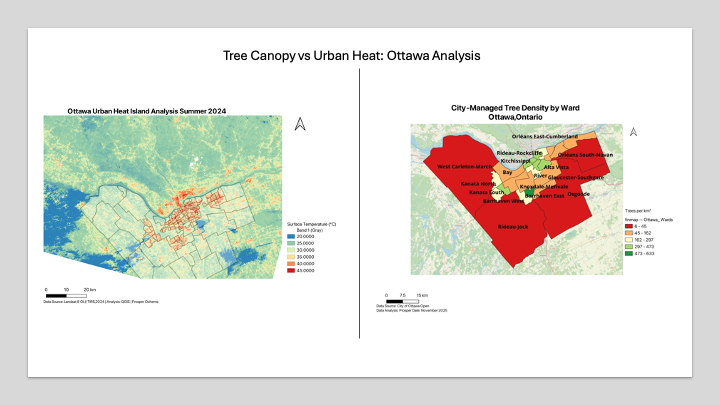

# Ottawa Urban Heat Island Analysis

## Project Overview
Remote sensing analysis identifying urban heat island effects across Ottawa using Landsat 8 thermal imagery. This project demonstrates the application of satellite-based temperature analysis for urban climate assessment.

## Key Findings

**Temperature Distribution:**
- Urban core temperatures: 40-45°C
- Suburban areas: 30-35°C
- Rural/vegetated areas: 20-25°C
- **Total variation: 25°C across city**

**Top 5 Hottest Neighborhoods:**
1. West Central - 40.7°C
2. Vanier South - 40.6°C
3. Overbrook - 39.9°C
4. Vanier North - 39.4°C
5. Carlington - 39.2°C

**Key Observation:** Strong inverse correlation between tree canopy density and surface temperature, demonstrating the cooling effect of urban vegetation.

## Methodology

**Data Sources:**
- Landsat 8 OLI/TIRS satellite imagery (2024)
- Ottawa neighborhood boundaries (City of Ottawa Open Data)
- Tree canopy data from Project 1 analysis

**Analysis Workflow:**
1. Land Surface Temperature (LST) calculation from Landsat thermal bands
2. NDVI calculation for vegetation assessment
3. Zonal statistics by neighborhood
4. Discrete temperature classification (6 classes: 20-45°C)
5. Correlation analysis with tree canopy coverage

**Tools & Software:**
- QGIS 3.x for spatial analysis
- Landsat 8 thermal band processing
- Zonal statistics for neighborhood-level aggregation

## Maps & Visualizations

**1. Urban Heat Island Map**
- Shows discrete temperature classes across Ottawa
- Clearly identifies downtown heat island effect
- 6 temperature zones from cool (blue) to hot (red)

**2. Tree Canopy vs Heat Comparison**
- Side-by-side visualization
- Demonstrates inverse relationship between vegetation and temperature
- Connects to Project 1 (Tree Canopy Distribution Analysis)
- 

## Portfolio Context

This is Project 3 in my GIS portfolio series:
- **Project 1:** City-Managed Tree Canopy Distribution
- **Project 2:** Transit Equity Analysis
- **Project 3:** Urban Heat Island Analysis (this project)

**Connection:** This analysis expands on Project 1 by quantifying the cooling benefits of urban tree canopy, providing evidence for green infrastructure investment priorities.

## Applications

This type of analysis supports:
- Climate adaptation planning
- Heat vulnerability assessment
- Urban forestry strategy
- Public health interventions
- Environmental equity initiatives

## Author
Prosper Ocheme  
Environmental Studies, BA | Aspiring GIS Analyst  
January 2026
